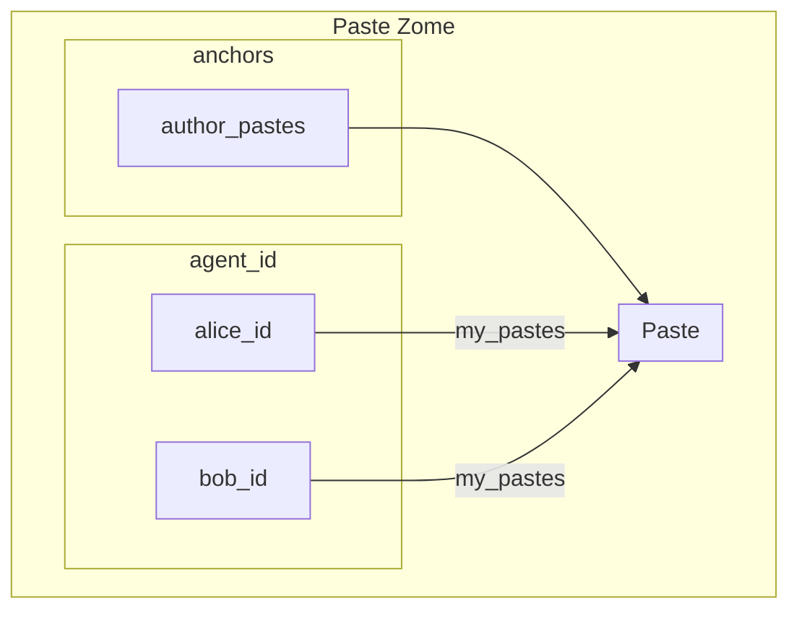

# into-pieces

"into pieces" is a holochain app where you can share text. Think of ghostbin which was taken [down](https://twitter.com/DHowett/status/1078494476568383494).

## User stories

Any agent should be able to 

- create, update (essentially fork) and remove pastes.
- query the list of created pastes.


## Entry structure

```rust
Entry "paste" {
	struct Paste {
		title: String,
		text: String,
		language: String,
		timestamp: u64,
		expiration: u64,
		author_id: Address,
		reported: bool
  }
	Links: {
		agent_id -> paste, link_type: "author_paste"
	}
}
```

```rust
Entry "anchor" {
	struct Anchor {
		anchor_type: String,
		anchor_text: Option<String>
	}
}
```

## Entry relationship diagram



## Validation

### Entries

* `paste`:
	* title should be <= 50 chars; 
  * text should be <= 1024 chars;
  * `agent_address` should match entry signer on create, update or delete entry.

* `anchors`:
  * `agent_address` should match entry signer on create;
  * anchor update or delete is not valid.
